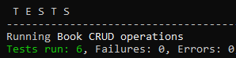

## Testing of [ThrillioWeb](https://github.com/VimalaMoger/ThrillioWeb/) APIs:

Dependencies added:
```text
    spring-boot-starter-web, spring-boot-devtools, Rest Assured, Hamcrest Matchers, TestNG, Gson library, io.cucumber, apache.poi, jackson library, Lombok
```


### Tasks

- Parameterize the API Tests with multiple data sets 
- Read static Json from an external file
- Pojo classes implementation
- Spec builder creation and logging
- Integrate Excel with Rest Assured - Data driven
- Integrate Cucumber with Rest Assured

<br>

- Jira REST APIs test
  	> Issue creation, update, GET and delete request, send File Attachment

Run tests:
   


### Cucumber tests from Maven cmd commands:

```
    mvn clean test
    mvn test -Dcucumber.options="--tags @addBook"
    mvn clean test -Dcucumber.filter.tags="@getBook"
    mvn test -Dcucumber.features="src/test/resources/features"
```




### Tips:

- Diff between mvn clean install and mvn clean test
    > mvn clean install executes both clean and install phase ``` clean phase\install phase includes validate\compile\test\package\verify\install ```
    > mvn test includes only phases up to test ``` validate\compile\test ```
- Dependency conflicts (JUnit vs. TestNG)
    > Maven Surefire plugin confused about which framework to use
      - Required both dependencies in this project
        - Solution: Force the Surefire provider to explicitly configure the maven-surefire-plugin to use JUnit
        - included org.apache.maven.surefire dependency in pom.xml plugin

